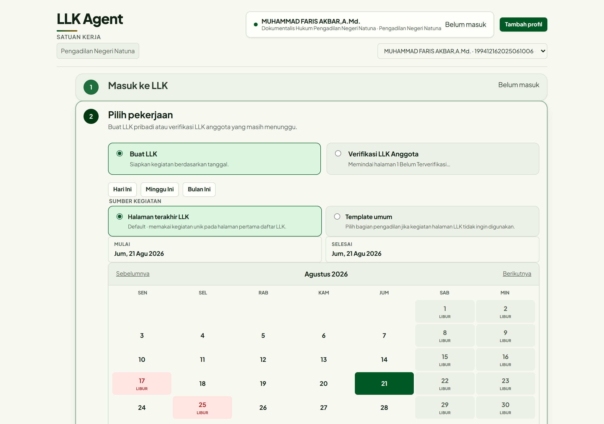

# LLK Agent — PN Natuna

Otomasi pengisian LLK harian untuk pegawai Pengadilan Negeri Negeri Natuna — dibuat karena **males nulis LLK tiap hari**.



## Fitur

- **Pratinjau isian LLK per rentang tanggal** — sumber kegiatan default adalah kegiatan unik dari halaman terakhir akun LLK kamu; alternatifnya template umum per bagian pengadilan.
- **Kalender kerja 2026** — libur nasional, cuti bersama (SKB 3 Menteri 2026), dan Sabtu/Minggu ditandai langsung di kalender; hari nonkerja otomatis dilewati saat menyusun isian.
- **Profil per pegawai** — konteks browser terpisah; nama, satker, dan atasan dibaca otomatis dari akun SSO.
- **Verifikasi & kirim** — cek daftar verifikasi dari atasan langsung dan kirim LLK tanpa buka situs.
- **Log & laporan lokal** — riwayat aktivitas dan hasil kirim tersimpan di folder data lokal.

## Menjalankan

Prasyarat: Windows, Microsoft Edge, [Node.js](https://nodejs.org) 20+.

```bash
cd llk-agent
npm install
npm start
```

Atau cukup jalankan dua-klik `LLK Agent.cmd` di folder utama, lalu buka <http://127.0.0.1:4545>.

Pertama kali:

1. Klik **Tambah profil**, isi NIP atasan langsung (18 digit).
2. Login SSO pada jendela Edge yang muncul.
3. Kembali ke aplikasi, klik **Saya sudah login** — selesai. Sesi berikutnya tidak perlu login ulang selama cookie belum kedaluwarsa.

## Privasi & data

Semua data runtime — cookie sesi SSO, profil browser, daftar pegawai — hanya ada di folder lokal `llk-agent/data/` dan `llk-agent/profiles/`. Folder itu sudah diabaikan Git dan **tidak pernah** dikirim ke mana pun selain situs resmi LLK. Jangan pernah membagikan atau meng-commit isinya.

## Lapor bug

Gunakan [tab Issues](https://github.com/sapyong13-design/llk-agent-pn-natuna/issues) — pilih template **Laporan bug**, sertakan langkah reproduksi, screenshot, dan versi Node (`node --version`). Jangan lampirkan cookie, isi folder `data/`, maupun data pribadi.

Usulan fitur juga lewat Issues dengan template **Usulan fitur**. Pull Request diterima: fork → branch → PR, akan direview pemilik repo.

## Lisensi

[MIT](LICENSE)
