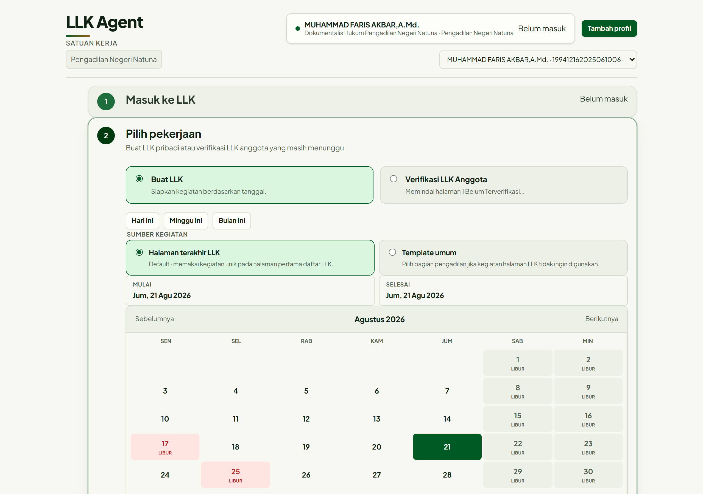

# LLK Agent — PN Natuna

Otomasi pengisian LLK harian untuk pegawai Pengadilan Negeri Natuna — dibuat karena **males nulis LLK tiap hari**.



## Fitur

- **Pratinjau isian LLK per rentang tanggal** — sumber kegiatan default adalah kegiatan unik dari halaman terakhir akun LLK kamu; alternatifnya template umum per bagian pengadilan.
- **Kalender kerja 2026** — libur nasional, cuti bersama (SKB 3 Menteri 2026), dan Sabtu/Minggu ditandai langsung di kalender; hari nonkerja otomatis dilewati saat menyusun isian.
- **Profil per pegawai** — konteks browser terpisah; nama, satker, dan atasan dibaca otomatis dari akun SSO.
- **Verifikasi & kirim** — cek daftar verifikasi dari atasan langsung dan kirim LLK tanpa buka situs.
- **Log & laporan lokal** — riwayat aktivitas dan hasil kirim tersimpan di folder data lokal.

## Menjalankan

Prasyarat: [Node.js](https://nodejs.org) 20.19+ dan browser biasa untuk membuka UI. Runtime tidak membutuhkan Edge, Chromium, Playwright, atau desktop server.

```bash
cd llk-agent
npm install
npm start
```

Atau cukup jalankan dua-klik `LLK Agent.cmd` di folder utama, lalu buka <http://127.0.0.1:4545>.

Pertama kali:

1. Isi **Nama pengguna SSO**, **Password SSO**, dan NIP atasan langsung (18 digit), lalu klik **Login SSO**.
2. Jika SSO meminta MFA, kolom **Kode authenticator** muncul. Masukkan kode terbaru, lalu klik **Verifikasi kode authenticator**. Kode salah dapat dicoba kembali tanpa mengulang password selama sesi login masih aktif.
3. Identitas, atasan, dan kegiatan dibaca otomatis setelah autentikasi berhasil. Periksa identitas pemeriksa sebelum mengirim LLK.

Branch `built-in-auth` memakai HTTP langsung untuk autentikasi CAS, MFA, profil/atasan, kegiatan, kalender, kirim LLK, dan verifikasi anggota. Tidak ada browser otomatis pada runtime. Playwright hanya dependensi pengembangan untuk smoke UI. Tantangan login yang belum didukung, termasuk pendaftaran MFA, harus diselesaikan di SSO resmi.

Sesi aplikasi dipisahkan per cookie browser: login/MFA, cookie SSO, identitas, template pribadi, kalender, progres, dan lock operasi tidak dibagikan ke pengguna lain, termasuk dua sesi dengan NIP sama. ID sesi acak 32 byte memakai cookie `HttpOnly`, `SameSite=Strict`, dan `Path=/`; ID dirotasi setelah autentikasi selesai. ID pegawai dan token tahap milik sesi lain ditolak. Tab pada profil browser yang sama berbagi sesi; gunakan profil browser berbeda untuk akun terpisah.

Login/MFA yang belum selesai berakhir setelah 10 menit. Sesi berakhir setelah 30 menit tanpa aktivitas API, saat **Akhiri sesi**, atau ketika proses agent berhenti. Logout hanya membuang sesi browser pemiliknya. Refresh meneruskan sesi aktif, tetapi draf isian/pesan lokal hilang. Kedaluwarsa tidak membatalkan pengiriman yang sudah berjalan; client dibersihkan setelah permintaan tersebut selesai, tanpa pengiriman ulang otomatis.

`ponytail:` penyimpanan sesi hanya memori satu proses Node.js. Hosting `llk.pn-natuna.go.id` memakai `passenger.cjs`, `LSAPI_CHILDREN=1`, dan lock native Linux `flock`; worker kedua ditolak, bukan diberi state sesi lain. Restart meminta login ulang. Untuk beberapa worker/instance, pindahkan state ke store bersama (misalnya Redis) dan lock terdistribusi. Node.js 16 tidak didukung; hosting terverifikasi memakai Node.js 24.21.0.

### Hosting cPanel / LiteSpeed

URL produksi: <https://llk.pn-natuna.go.id>. Root aplikasi privat `/home/pnnatuna/private/llk/current`; document root terpisah `/home/pnnatuna/llk.pn-natuna.go.id`, tidak berbagi `public_html` Joomla. Startup hosting **passenger.cjs**, bukan launcher lokal `start.mjs`. Dependensi produksi: `npm ci --omit=dev --no-audit --no-fund` melalui environment Node selector.

Konfigurasi wajib: `LLK_PUBLIC_ORIGIN=https://llk.pn-natuna.go.id`, `LLK_TRUSTED_PROXY=loopback`, `LLK_RUNTIME_DIR=/home/pnnatuna/private/llk/runtime` (0700), `LSAPI_CHILDREN=1`, `LLK_PROXY_PROTOCOL_HEADER=x-forwarded-proto`, `LLK_PROXY_PROTOCOL_VALUE=https`, `LLK_PROXY_CLIENT_IP_HEADER=x-forwarded-for`, `LLK_PROXY_CLIENT_IP_MODE=last`, serta `LLK_PROXY_SECRET` acak privat. Jangan menaruh nilai secret di Git/chat. `.htaccess` harus mode 0644 agar LiteSpeed membaca routing; konfigurasi/skrip privat mode 0600.

Frontend LiteSpeed memaksa HTTP ke HTTPS **sebelum** Passenger serta unset/set `X-LLK-Proxy-Secret` sesuai secret backend. Kontrak terverifikasi: listener `address()` Unix socket, request `remoteAddress` loopback sintetis, X-Forwarded-For berakhiran IP klien aktual. Backend menerima proxy hanya pada listener privat, remote loopback, secret tepat, dan marker HTTPS tepat; header TCP tanpa secret tidak dipercaya. HTTP dengan X-Forwarded-Proto palsu tetap redirect. Jangan mengganti kontrak proxy tanpa menguji ulang.

Cookie hosting `__Host-llk-session` memakai Secure/HttpOnly/SameSite=Strict/Path=/, tidak memakai Domain. Origin/Host harus tepat, termasuk DELETE. Batas publik: 200 sesi, 20 sesi baru/IP/15 menit, 20 percobaan login/MFA/complete/IP/15 menit, 8 percobaan/sesi/5 menit, 1024 bucket IP, body 1 MB. Balasan 429 mempunyai Retry-After. IP kantor bersama memakai anggaran bersama. State dibersihkan sesuai TTL; restart tidak mempertahankan cookie SSO.

Rilis awal privat: `/home/pnnatuna/private/llk/releases/20261006-https`; bukti uji di `/home/pnnatuna/private/llk-deploy`. File data/laporan/audit tidak dipublikasikan. Update: backup source+config privat, hentikan aplikasi LLK, salin hanya allowlist rilis ke root aplikasi (jangan timpa node_modules/data runtime), install dependensi, lalu start dan uji HTTPS/sesi. Perintah `cloudlinux-selector restart` pernah meninggalkan worker lama; jika perlu hentikan PID yang terbukti milik `lsnode:/home/pnnatuna/private/llk/current/`, bukan proses Joomla lain. Rollback pertama mengembalikan subdomain ke maintenance 503; update berikutnya kembali ke backup rilis dan konfigurasi LLK sebelumnya. Restart/logout menghapus sesi, bukan laporan.

Update GitHub melalui checkout privat `/home/pnnatuna/repos/llk-agent-pn-natuna`, branch `built-in-auth`:

```bash
cd /home/pnnatuna/repos/llk-agent-pn-natuna
git pull --ff-only origin built-in-auth
bash llk-agent/deploy-cpanel.sh --prepare
# Saat pengguna selesai bekerja; restart menghapus sesi aktif:
bash llk-agent/deploy-cpanel.sh --apply
```

`--prepare` mengambil allowlist dari commit bersih, menginstal dependensi dan menguji rilis terpisah tanpa restart produksi. `--apply` mengulangi pemeriksaan, menyimpan backup aplikasi+konfigurasi privat, menghentikan hanya worker LLK dan menunggu lock operasi, menyalin rilis tanpa menimpa laporan/audit/secret, lalu start dan memeriksa API sesi HTTPS. Kegagalan cutover memulihkan backup. Jangan `git pull` di `current` atau `public_html`; push saja tidak mengubah produksi.

Form authenticator CAS memakai `token` dan `accountId`; pada halaman SSO saat ini `accountId` diisi oleh JavaScript inline. Klien HTTP membaca deklarasi numeriknya tanpa menjalankan script upstream. Regresi memastikan pilihan akun MFA ikut dikirim, termasuk saat kode dicoba ulang.

Kalender membaca seluruh halaman daftar LLK, menampilkan jumlah halaman dan waktu pembacaan. Tanggal tanpa label Terisi hanya dianggap belum terisi setelah pemindaian lengkap; pembacaan gagal tidak dianggap kosong. Sumber kegiatan default tetap halaman terakhir. Sebelum kirim, tanggal duplikat diperiksa pada seluruh halaman. Setiap tanggal memakai form/CSRF baru; keberhasilan harus terbukti dari tanggal dan isi yang terbaca kembali. Verifikasi anggota memindai filter Belum Terverifikasi, menahan target tidak valid, lalu memeriksa status dan pesan tersimpan setelah kirim. POST tidak dicoba ulang otomatis jika gagal atau hasil belum pasti.

Status verifikasi dibaca dari label daftar resmi, bukan hidden `verified=2` pada form edit. Field tersebut adalah tindakan yang akan dikirim dan dapat bernilai 2 ketika LLK masih Belum Terverifikasi. Pemeriksaan sebelum/sesudah POST mencocokkan ID numerik `hllk` dari form edit pada seluruh halaman daftar, bukan kesamaan URL `cid`; pesan juga dibaca kembali. Regresi memakai hidden `verified=2` dan URL `cid` berbeda sebelum/sesudah kirim.

Verifikasi memakai satu snapshot status sebelum batch dan satu setelah batch, bukan pemindaian ulang untuk setiap target. ID `hllk` tetap dicocokkan; form/CSRF dimuat baru tepat sebelum setiap POST, pengiriman tetap berurutan, dan status serta pesan tersimpan tetap wajib terbukti. Regresi 3 target membutuhkan 2 scan status, 9 pembacaan form, dan 3 POST; bukan ukuran durasi produksi.

Form login menyediakan **Nama Satker** dengan **Pengadilan Negeri Natuna** terpilih, serta pilihan 13 pejabat/hakim dan NIP dari profil resmi PN Natuna (dibaca 5 Oktober 2026). Pilihan mengisi NIP pemeriksa; NIP manual tetap tersedia. Daftar jabatan bukan penetapan otomatis atasan langsung. NIP hakim ad-hoc yang tidak dipublikasikan tidak ditebak. Lookup LLK tetap memverifikasi identitas pemeriksa setelah login.

Pemeriksa dipilih satu kali: NIP ditampilkan sebagai konfirmasi; opsi **Masukkan NIP manual** membuka kolom input. Kalender menampilkan hitungan hari kerja terisi/belum terisi sampai hari ini hanya setelah pemindaian lengkap. **Pilih hari kerja belum terisi** memilih tanggal nonkontigu yang belum terisi, mengecualikan libur dan akhir pekan; pratinjau serta konfirmasi kirim tetap wajib. Status verifikasi membedakan mengirim dan memastikan tersimpan; hasil dikelompokkan menjadi Belum pasti, Gagal, Berhasil (rincian tertutup), dan Ditahan. Log aktivitas tetap terbuka untuk tracking masalah.

## Privasi & data

Password dan kode authenticator diteruskan melalui backend aplikasi ke SSO resmi lewat HTTPS; tidak disimpan atau dicatat. Pada hosting, kredensial melewati server hosting dan cookie SSO berada di memori server itu, bukan komputer pengguna. Browser hanya menerima ID sesi aplikasi. Laporan tiap pengiriman memakai nama acak `report-<id>.json` agar sesi dengan NIP sama tidak saling menimpa; audit append-only di direktori data privat. File tersebut tidak dilayani API/static server. Folder `data/` dan `profiles/` lama diabaikan Git; jangan membagikan atau meng-commit isinya. Input sensitif dibersihkan setelah pengiriman, tetapi JavaScript tidak menjamin penghapusan byte dari memori secara langsung.

Akses aplikasi melalui `http://127.0.0.1:4545`; backend menolak Host lain, koneksi non-loopback, fetch lintas situs, dan semua metode mutasi (termasuk DELETE) tanpa Origin lokal tepat serta JSON. Cookie lokal HTTP sengaja tidak memakai `Secure`; jangan membuka port ini ke internet. Bukti pengujian sebelumnya: halaman CAS resmi dicapai lewat HTTP; transisi MFA, percobaan ulang kode, dan redirect diuji dengan upstream sintetis. Pada 5 Oktober 2026, pengguna menyelesaikan login dan MFA akun nyata di aplikasi; backend membaca identitas akun serta memverifikasi atasan setelah perbaikan `accountId`. Pengujian ini tidak mengirim atau memverifikasi LLK.

Migrasi HTTP penuh diuji baca-saja dengan sesi nyata: profil/lookup atasan, 221 tanggal pada 9 halaman, dan 14 LLK anggota (10 siap, 4 ditahan). Pengiriman serta verifikasi diuji terisolasi: CSRF baru, status/isi tersimpan, HTTP 403, dan respons hilang tanpa pengiriman ulang. Tidak ada POST pengiriman/verifikasi ke produksi saat pengujian.

Regresi multi-user: `cd llk-agent` lalu `node multi-user-check.mjs`. Menguji HTTP dua login/MFA bersamaan, penolakan akses silang/token tahap, rotasi cookie, sesi NIP sama, cache/template/progres/lock, logout, kedaluwarsa, DELETE lintas origin, dan laporan tanpa bentrok. Semua upstream sintetis; tidak mengirim LLK produksi. Pemeriksaan tambahan: `node submit-check.mjs`, `node cas-auth-check.mjs`, dan `node llk-http-check.mjs`.

Uji hosting: `node hosting-check.mjs` membuktikan HTTPS/proxy, cookie Secure, Host/Origin/DELETE, dotfiles/404, batas sesi/IP dan percobaan autentikasi pada HTTP native. Node.js 24.21.0 lokal dan Linux hosting lolos semua pemeriksaan di atas. Produksi membuktikan UI desktop/390px, cookie dua konteks browser berbeda, logout terisolasi, penolakan akses anonim, redirect HTTP, laporan privat, marker proxy, lock worker kedua, dan form CAS resmi lewat HTTPS tanpa mengirim kredensial. Login akun nyata/MFA serta pembacaan data pegawai dari hosting memerlukan pengguna login sendiri; pengiriman/verifikasi LLK produksi tidak dijalankan untuk deployment.

## Lapor bug

Gunakan [tab Issues](https://github.com/sapyong13-design/llk-agent-pn-natuna/issues) — pilih template **Laporan bug**, sertakan langkah reproduksi, screenshot, dan versi Node (`node --version`). Jangan lampirkan cookie, isi folder `data/`, maupun data pribadi.

Usulan fitur juga lewat Issues dengan template **Usulan fitur**. Pull Request diterima: fork → branch → PR, akan direview pemilik repo.

## Lisensi

[MIT](LICENSE)
